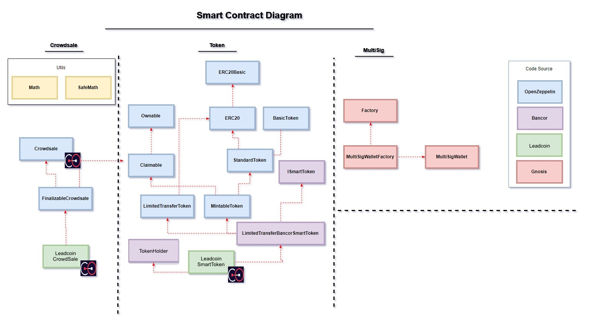

# LeadCoin's Crowdsale Contracts

Please see below LeadCoin smart contracts for the [LeadCoin Crowdsale][leadcoin].


LDC is an ERC-20 compliant cryptocurrency built on top of the [Ethereum][ethereum] blockchain.


## Contracts

Please see the [contracts/](contracts) directory.

## The Crowdsale Specification
*	LDC token is ERC-20 compliant.
*	LDC Token is [Bancor][bancor] compliant.
*	Token allocation:
	* 50% of the total number of LDC tokens will be allocated to contributors during the token sale.
	* 10% of the total number of LDC tokens will be allocated to the team.
	* 10% of the total number of LDC tokens will be allocated to Webydo LTD, the first node in the network.
	* 30% of the total number of LDC tokens will be allocated to LeadCoin, to be used for future strategic plans and to develop the LeadCoin' ecosystem.

## LDC PRICING PROGRAM
The LDC / ETH rate will be 15000 LDC for every ETH


## Develop

* Contracts are written in [Solidity][solidity] and tested using [Truffle][truffle] and [testrpc][testrpc].

* Our smart contract is based on [Sirin Labs ICO][sirinlabicogithub] and [Open Zeppelin][openzeppelin] smart contracts [v1.3.0][openzeppelin_v1.3.0] (latest OZ commit merged is 8e01dd14f9211239213ae7bd4c6af92dd18d4ab7 from 24.10.2017).

* LDC token is a **SmartToken**, implementing Bancor's SmartToken contract.

## Audit

The contract was audited by several Ethereum blockchain experts.

No potential vulnerabilities have been identified in the crowdsale and token contract.

* [Matthew di Ferrante][mattdf] and [Dean Eigenmann][decnus], well-known Ethereum experts who have provided auditing services for many other token sale contracts. 

  The audit report is available here:
     
https://github.com/LeadcoinNetwork/crowdsale-smart-contract/blob/master/audit/leadcoin-audit.pdf
  
## Code
 
#### Class Diagram  



#### LeadCoinCrowdsale Functions


**getTotalFundsRaised**
```cs
function getTotalFundsRaised() public view returns (uint256)
```
Returns the total funds collected in wei(ETH and none ETH).

**addUpdateGrantee**
```cs
function addUpdateGrantee(address _grantee, uint256 _value) external onlyOwner beforeFinzalized
```
Adds/Updates address and token allocation for token grants.

Granted tokens are allocated to non-Ether, presale, buyers.


**setFiatRaisedConvertedToWei**
```cs
function setFiatRaisedConvertedToWei(uint256 _fiatRaisedConvertedToWei) external onlyOwner onlyWhileSale
```
Sets funds collected outside the crowdsale in wei.
funds are converted to wei using the market conversion rate of USD\ETH on the day on the purchase.


**hasEnded**
```cs
function hasEnded() public view returns (bool) {
```
Return true if the crowdsale cap was reached or endTime reached ( override crowdsale.sol)


**validPurchase**
```cs
function validPurchase() internal view returns (bool) {
```
Return true if hardcap was not reached ( override crowdsale.sol)


**deleteGrantee**
```cs
function deleteGrantee(address _grantee) external onlyOwner beforeFinzalized
```
Deletes entries from the grants list.


**claimTokenOwnership**
```cs
function claimTokenOwnership() external onlyOwner
```
Accepts new ownership on behalf of the LeadCoinCrowdsale contract. This can be used, by the token sale contract itself to claim back ownership of the LeadCoinSmartToken contract.

#### LeadCoinCrowdsale Events

**GrantAdded**
```cs
event GrantAdded(address indexed _grantee, uint256 _amount);
```


**GrantUpdated**
```cs
event GrantUpdated(address indexed _grantee, uint256 _oldAmount, uint256 _newAmount);
```


**GrantDeleted**
```cs
event GrantDeleted(address indexed _grantee, uint256 _hadAmount);
```

**FiatRaisedUpdated**
```cs
event FiatRaisedUpdated(address indexed _address, uint256 _fiatRaised)
```


### Dependencies

```bash
# Install Truffle and testrpc packages globally:
$ npm install -g truffle ethereumjs-testrpc

# Install local node dependencies:
$ npm install
```

### Test

```bash
$ ./scripts/test.sh
```


### Code Coverage

```bash
$ ./scripts/coverage.sh
```

## Collaborators

* **[Alexey Murashkevich](https://github.com/alexeym2012)**
* **[Shai Ament](https://github.com/doubleorseven)**


## License

Apache License v2.0


[leadcoin]: https://www.leadcoin.network
[ethereum]: https://www.ethereum.org/

[solidity]: https://solidity.readthedocs.io/en/develop/
[truffle]: http://truffleframework.com/
[testrpc]: https://github.com/ethereumjs/testrpc
[bancor]: https://github.com/bancorprotocol/contracts
[openzeppelin]: https://openzeppelin.org
[sirinlabicogithub]: https://github.com/sirin-labs/crowdsale-smart-contract
[openzeppelin_v1.3.0]: https://github.com/OpenZeppelin/zeppelin-solidity/releases/tag/v1.3.0
[mattdf]: http://github.com/mattdf
[decnus]: http://github.com/decanus